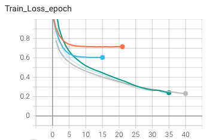
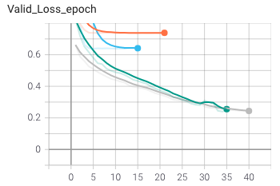

# Semantic Segmentation

### 1 Model Architecture

Three models were experimented:
* SETR: A pure transformer encoder model and a variety of decoder unsampling models to perform semantic segmentation tasks. This model was adapted from and implemented based on the paper published in December 2020 by Sixiao Zheng et al., titled [*Rethinking Semantic Segmentation from a Sequence-to-Sequence Perspective
with Transformers*](https://arxiv.org/abs/2012.15840). In particular, the SETR-PUP and SETR-MLA variants, that is, the models with progressive upsampling and multi-level feature aggregation decoders, are selected and implemented based on their state-of-the-art performance on benchmark datasets.
* TransUNet: A UNet-transformer hybrid model that uses UNet to extract high-resolution feature maps, a transformer to tokenize and encode images, and a UNet-like mechanism to upsample in decoder using previously-extracted feature maps. This model was adapted from and implemented based on the paper published in February 2021 by Jieneng Chen et al., titled [*TransUNet: Transformers Make Strong Encoders for Medical Image Segmentation*](https://arxiv.org/abs/2102.04306).
* UNet: the well-known UNet model. This variant of UNet, which is 4-layers deep in the architecture, is adapted and implemented based on the paper published in November 2018 by Ari Silburt et al., titled [*Lunar Crater Identification via Deep Learning*](https://arxiv.org/abs/1803.02192).

### 2 Classification Loss

Two loss functions were experimented:
* Cross Entropy between the predicted and groundtruth class assignments of the pixels in a given frame, as implemented in [torch.nn.CrossEntropyLoss](https://pytorch.org/docs/stable/generated/torch.nn.CrossEntropyLoss.html). 
* As suggested in the TransUNet paper, a combination of the Cross Entropy loss as above, and the Dice loss between predicted and groundtruth class assignments of the pixels in a given frame. The loss function is implemented in `utils.py`. The final loss is a 1:1 weighted sum of the Cross Entropy loss and the Dice loss.

### 3 Dataset

The models were trained on the [Cityscapes dataset](https://www.cityscapes-dataset.com). In particular, the [dataset](https://people.eecs.berkeley.edu/~tinghuiz/projects/pix2pix/datasets/) used for training is a subset of processed subsample created for the [Pix2Pix project](https://phillipi.github.io/pix2pix/) and the paper published in Nov 2018 by Phillip et al., titled [Image-to-Image Translation with Conditional Adversarial Networks](https://arxiv.org/abs/1611.07004). The dataset contains 2975 training images and 500 validation images in which each image (256 x 256) is attached with an annotated classification label map. The images were extracted from videos recorded in Germany.

### 4 Training

Due to the intrinsic limitation of the transformer models' gigantic size (> 150M parameters), the available computing power is insufficient and inefficient for SETR and TransUNet training. Although the architecture and training code were implemented, the training task of the two models was omitted.

The UNet was trained on Tesla T4 on Google Colab. 

The model was trained with 40 epochs, 1e-3 learning rate. Batchsize was set to be 16. After several training instances, it was observed that although the model trained by the combination of Cross Entropy and Dice loss yields higher IoU during test inference, the model trained by Cross Entropy alone achieves better results from visual observation. The Adam optimizer was used.

|   | UNet Training |
| ------------- | ------------- | 
| Train  |   | 
| Validation  |   | 

### 5 Results and Visualization

The best validation loss observed is 0.2391 CE from UNet. The model consistently achieves an IoU of > 0.995 during image test inference. Yet, the visualization result was flawed since the groundtruth classification matrix is created by K-Means clustering on a 256000 x 3 colour matrix with 13 classes, due to the unstability of JPEG image colour compression. Other possible contributing factors include the intrinsic limitation of model architecture (ie. design and/or complexity), small dataset cardinality, the small variance in dataset, environmental variances during testing, etc.

  
  
  
 

It can be observed that the model can perform reasonable semantic segmentation task when inferenced on test image and videos. 

### 6 Model training or testing instructions

Checkpoint for UNet (~415MB) can be downloaded via this [link](https://drive.google.com/file/d/14cW8KHxBCA4xSTKeV7kXgMZbKpnc0wv0/view?usp=sharing). For usage, proceed to place it to `./checkpoints/UNet/U-Net2.pth`.

* Set up all configurations in `config.py`.
* To train networks, `python train.py`.
* To inference networks on test images or videos, `python inference.py`. The inference speed is between 15~20 fps on a Tesla T4 GPU.
* To observe training history in tensorboard, `tensorboard --logdir runs`.
* Model architectures are defined in `SETR_models` and `TransUNet_models` directories, as well as `unet_model.py`.

### 7 Acknowledgement and Reference

* Sixiao Zheng et al.'s 2020 paper [*Rethinking Semantic Segmentation from a Sequence-to-Sequence Perspective with Transformers*](https://arxiv.org/abs/2012.15840), and its [affiliated repo](https://github.com/gupta-abhay/setr-pytorch) by Abhay Gupta.
* Jieneng Chen et al.'s 2021 paper [*TransUNet: Transformers Make Strong Encoders for Medical Image Segmentation*](https://arxiv.org/abs/2102.04306), and its [official affiliated repo](https://github.com/Beckschen/TransUNet).
* Ari Silburt et al.'s 2018 paper [*Lunar Crater Identification via Deep Learning*](https://arxiv.org/abs/1803.02192).
* Aashu Prasad's *Kaggle* tutorial [*Video Segmentation Self Driving Cars OpenCV Pytorch*](https://www.kaggle.com/aashuprasad/videosegmentation-selfdrivingcars-opencv-pytorch).
* The subset of Cityscape dataset for the [Pix2Pix project](https://phillipi.github.io/pix2pix/).
* Maxime's *Inside Machine Learning* tutorial [*What is a Transformer*](https://medium.com/inside-machine-learning/what-is-a-transformer-d07dd1fbec04).
