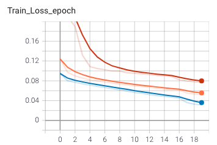
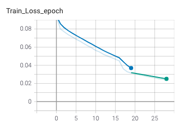
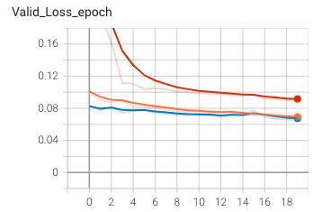
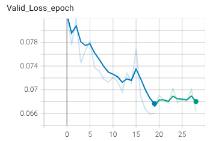
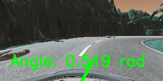

# Steering Angle Prediction

### 1 Model Architecture

Three models were experimented:
* TruckNN: A CNN model adapted and modified from NVIDIA's 2016 paper [*End to End Learning for Self-Driving Cars*](https://arxiv.org/abs/1604.07316). The original model was augmented with batch normalization layers and dropout layers.
* TruckResnet50: A CNN transfer learning model utilizing feature maps extracted by ResNet50, connected to additional fully-connected layers. This model was adapated and modified from Du et al.'s 2019 paper [*Self-Driving Car Steering Angle Prediction Based on Image Recognition*](https://arxiv.org/abs/1912.05440). The first 141 layers of the ResNet50 layers (instead of the first 45 layers as in the original paper) were frozen from updating. Dimensions of the fully-connected layers were also modified.
* TruckRNN: A Conv3D-LSTM model, also based on and modified from Du et al.'s 2019 paper mentioned above, was also experimented. The model consumes a sequence of 15 consecutive frames as input, and predicts the steering angle at the last frame. Comparing to the original model, maxpooling layers were omitted and batch normalization layers were introduced. 5 convolutional layers were implemented with the last convolutional layer connected with residual output, followed by two LSTM layers, which is rather different to the model architecture proposed in the paper.

### 2 Regression Loss

The loss function is the standard MSE loss between the predicted and groundtruth steering angles, as implemented in [torch.nn.MSELoss](https://pytorch.org/docs/stable/generated/torch.nn.MSELoss.html). For all three models, the mean of all tensor elements' MSE loss was used.

### 3 Dataset

The models were trained on driving scene images simulated and extracted from [Udacity's self-driving car simulator](https://github.com/udacity/self-driving-car-sim). The [dataset (~1.35GB)](https://www.kaggle.com/zaynena/selfdriving-car-simulator) contains 97330 images (320x160) with steering angles labelled. 

### 4 Training

Models were trained on Tesla T4 on Google Colab. 

All three models were first trained with 20 epochs, 1e-4 learning rate. For TruckNN and TruckResnet50, batch size is set to be 32, and that of TruckRNN is set to be 8. It was observed that TruckResnet50 out-performs other models, and hence was further trained to 40 epochs with early stopping tolerance of 10 epochs. Yet, no improvement of the loss was observed.

|   | Models Comparison | TruckResnet50 continued training |
| ------------- | ------------- | ------------- |
| Train  |   | |
| Validation  |   | |

### 5 Results and Visualization

The best validation loss observed is 0.066 MSE (or 0.25) from TruckResnet50, which is worse than the loss claimed in the paper by an entire degree. Possible contributing factors include lack of training resources, limited dataset, difference in dataset content (simulator vs real world) and environmental variances, etc.

Despite of this, it can be observed that the models' predictions are reasonable to a high degree.

   
 

For further visualization, saliency maps of the last Resnet50 Convolutional layer (layer4) can be observed as below:
 

The model seems to possess salient features on the road.

### 6 Model training or testing instructions

Pretrained checkpoints for TruckNN and TruckRNN can be found in `checkpoints` directory. Checkpoint for TruckResnet50 can be downloaded via this [link](https://drive.google.com/file/d/1P9DB27bXgqySR7fRcAHog6xr2d-fRQCh/view?usp=sharing). For usage, proceed to place it to `./checkpoints/TruckResnet50/best_ckpt_1.pth`.

* Set up all configurations in `config.py`.
* To train networks, `python train.py`.
* To inference networks on test images, `python inference.py`.
* To visualize salient maps, `python visualize.py`.
* To observe training history in tensorboard, `tensorboard --logdir runs`.

### 7 Acknowledgement and Reference

* NVIDIA 2016 paper [*End to End Learning for Self-Driving Cars*](https://arxiv.org/abs/1604.07316).
* Du et al.'s 2019 paper [*Self-Driving Car Steering Angle Prediction Based on Image Recognition*](https://arxiv.org/abs/1912.05440), and its [affiliated repo](https://github.com/FangLintao/Self-Driving-Car).
* Manajit Pal's *towards data science* tutorial [*Deep Learning for Self-Driving Cars*](https://towardsdatascience.com/deep-learning-for-self-driving-cars-7f198ef4cfa2), as well as its [affiliated repo](https://github.com/ManajitPal/DeepLearningForSelfDrivingCars).
* Aditya Rastogi's *Data Driven Investor* tutorial [*Visualizing Neural Networks using Saliency Maps*](https://medium.datadriveninvestor.com/visualizing-neural-networks-using-saliency-maps-in-pytorch-289d8e244ab4).
* Zhenye Na's *Self-Driving Car Simulator* [dataset on Kaggle](https://www.kaggle.com/zaynena/selfdriving-car-simulator).
